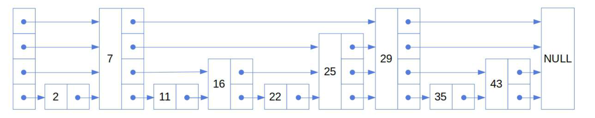
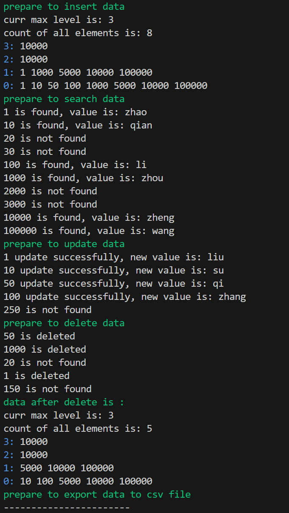
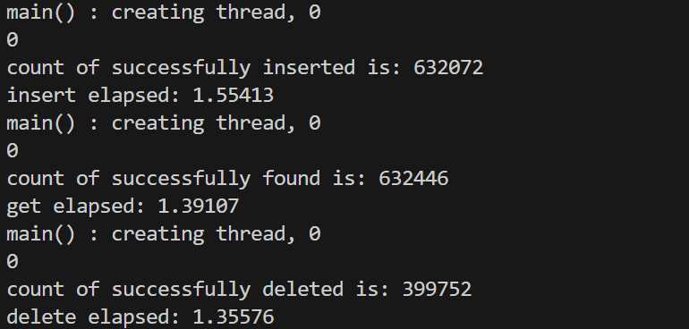

## 基于跳表的KV存储引擎
### 简述
1. 项目参考来源：https://github.com/youngyangyang04/Skiplist-CPP

2. 跳表理论学习：https://www.baeldung.com/cs/skip-lists



3. 插入、删除、查找、更新等测试过程位于`main.cpp`，测试结果如下:



3. 压力测试
使用 1 中提到的项目参考来源中的压力测试代码，同时注释掉相关的所有 `cout` 输出，`CMakeLists` 中添加 `-O3` 编译优化，最终百万数据量（Key为整型，Value为字符串）的压力测试结果为:  

| 插入 | 64.33w |
| --- | -------|
| 查找 | 71.88w |
| 删除 | 73.75w |



### 编译运行
```
git clone git@github.com:xiaoshan423/skiplist_cpp.git
cd build
rm -rf *
cmake ..
make
# 基本测试
./mySkipList
# 压力测试
./stress-test
```